# PharoByExample150

By the book , captain - spock - the wrath of khan - star trek.

Lets get started .

This is a very simple introduction to Pharo smalltalk , what you learn here is applicable to every Smalltalk.

To install pharo - you can download and run the launcher 

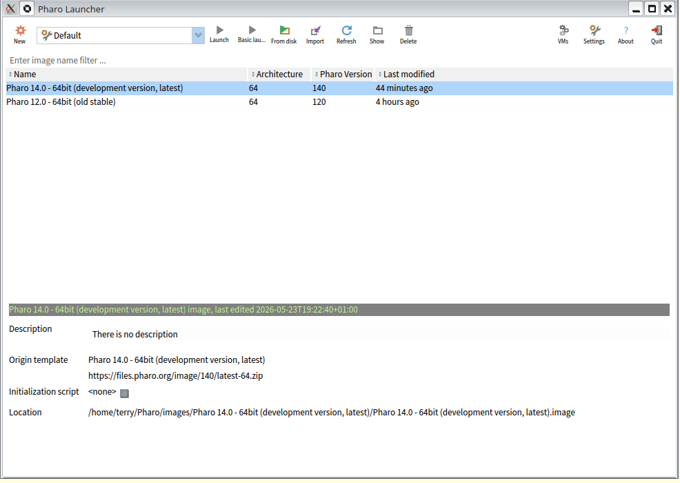

click new for a new image

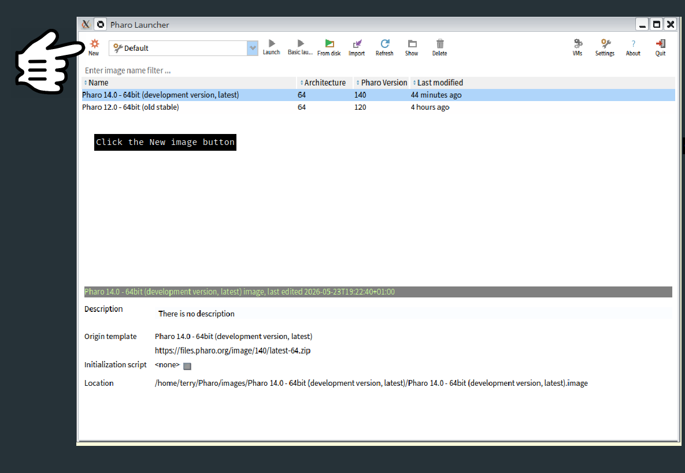

now click create image

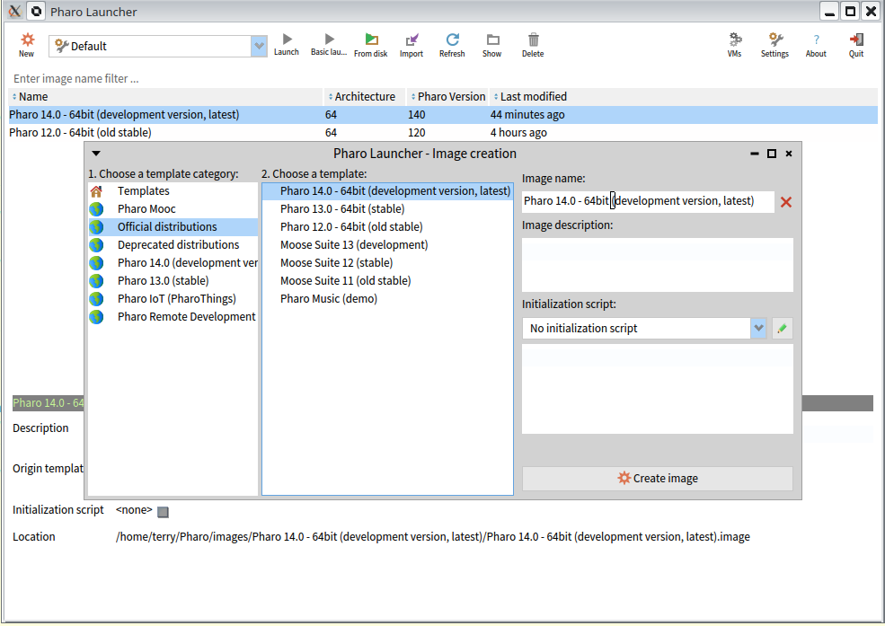

pharo-launcher-step2-2026-05-23_20-08.png

If you managed to download and install pharo successfully you will be greeted with a window that looks something like this

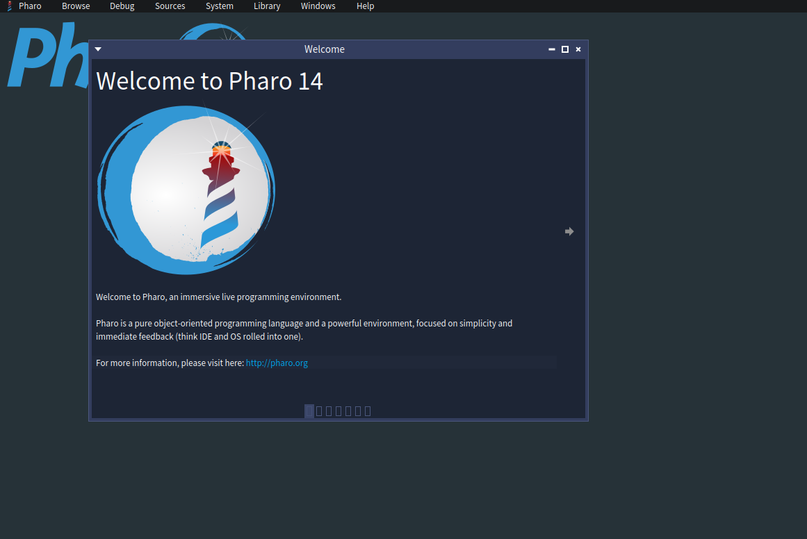

This is the welcome screen of Pharo 

As a beginner you will want to start with the Playground.

You can open a playground by pressing Ctrl + O + P .

Holding down the 'Control key' - your keyboard may have a key that says 'Ctrl' . 

While keeping the 'Control key' pressed down , press and *release* the letter 'O' key - O for Oranges , now press and *release* the letter 'P' key - P for Peter .

you should hopefully see something like this , it will say Playground on the title of the window

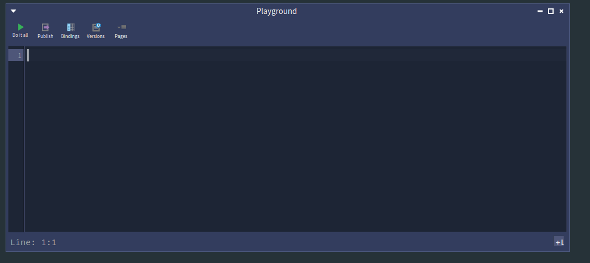

Lets type a quick program into the playground

```
'Hello' reverse. 
```

In Smalltalk something surrounded by single quotes is interpreted as a String.

We are sending the message 'reverse' to the string 'Hello' .


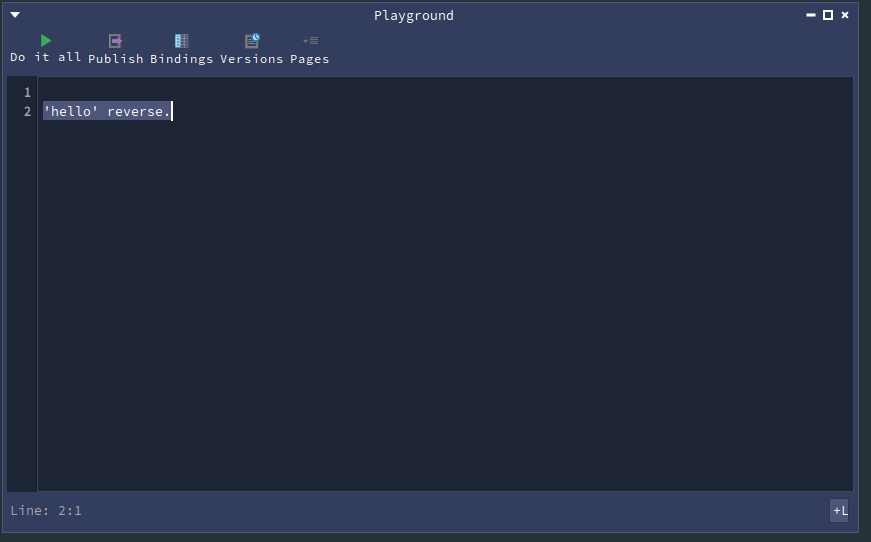

Inside the playground I have written a small program , you can type this is in as well 


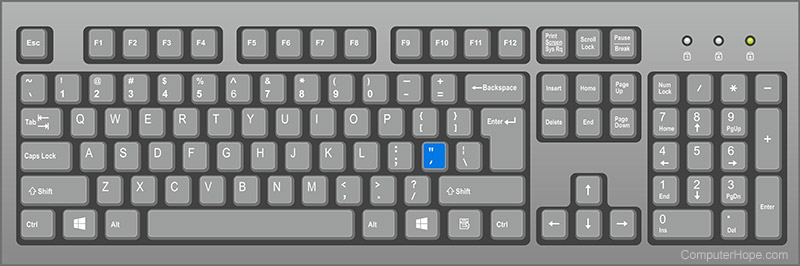


To run this program can press the do it all button 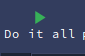

you will see an Inspector open up 

The inspector allows us access inside the result that we got handed back.

In this case the letters of Hello reversed or rather olleH .

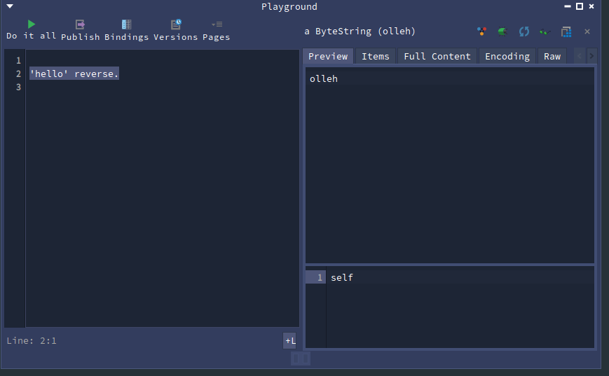

To recap - we have opened a Playground , wrote a simple program , run the program , got the result


The Playground is split into two regions 

We have a main coding area initially 

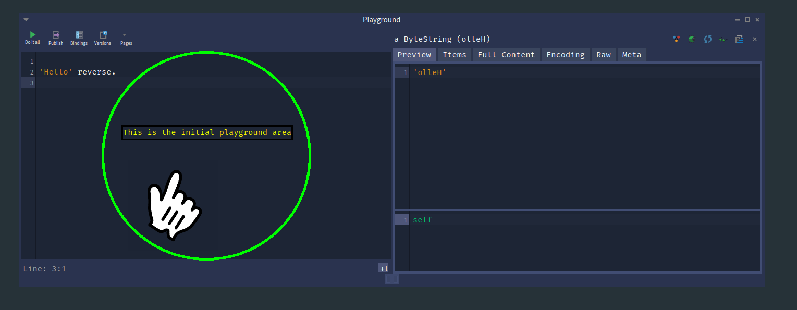

and inspector regions which themselves have a mini playground at the bottom

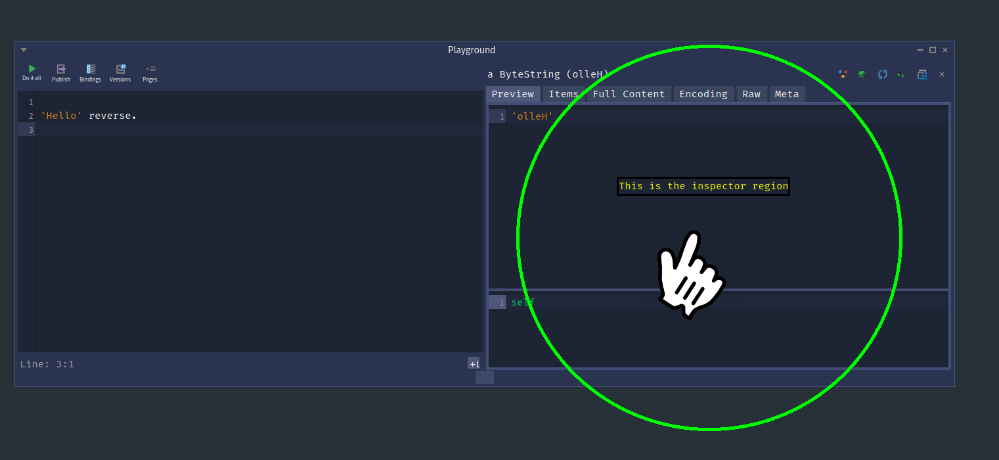

the mini playground at the bottom is in context of the result above 

given a different result - the context will be different.


# Appendix 

Some essential morph code to load images from local disk and internet urls , some text and circles ,
makes highlighting and explaining what is going on a lot easier to the reader.

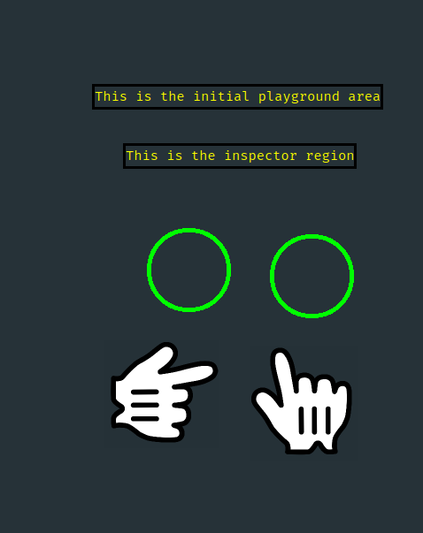


```
handForm := ImageReadWriter formFromFileNamed: '/home/terry/code/PharoByExample150/docs/Chapters/Chapter1/figures/hand-pointer-icon.png'.
pointer := ImageMorph new form: handForm; openInWorld; yourself.


handForm := ImageReadWriter formFromFileNamed: '/home/terry/code/PharoByExample150/docs/Chapters/Chapter1/figures/pharo-launcher-2026-05-23_20-07.png'.
pointer := ImageMorph new form: handForm; openInWorld; yourself.


"Load an image from a URL and create an ImageMorph"
handImage := ZnEasy getPng: 'https://images.icon-icons.com/1464/PNG/512/pointinghand_100160.png'.
pointer := ImageMorph new form: handImage; openInWorld; yourself.

"Move it programmatically"
pointer position: 300@300.

circle := CircleMorph new openInWorld ; color: (Color white alpha: 0.0) ; borderWidth: 5 ; borderColor: (Color green) ; extent: 300@300 ; yourself.

"Create a TextMorph with explanatory text"
indicator := TextMorph new.
indicator contents: 'This is the inspector region';
    color: Color yellow;
    borderWidth: 3;
    borderColor: Color black;
    extent: 200@40;
    position: 100@100;
    openInWorld.


"change text , foreground and background colours"
indicator color: (Color white) . 
indicator backgroundColor: (Color black).
indicator contents: 'Click here'.


```


