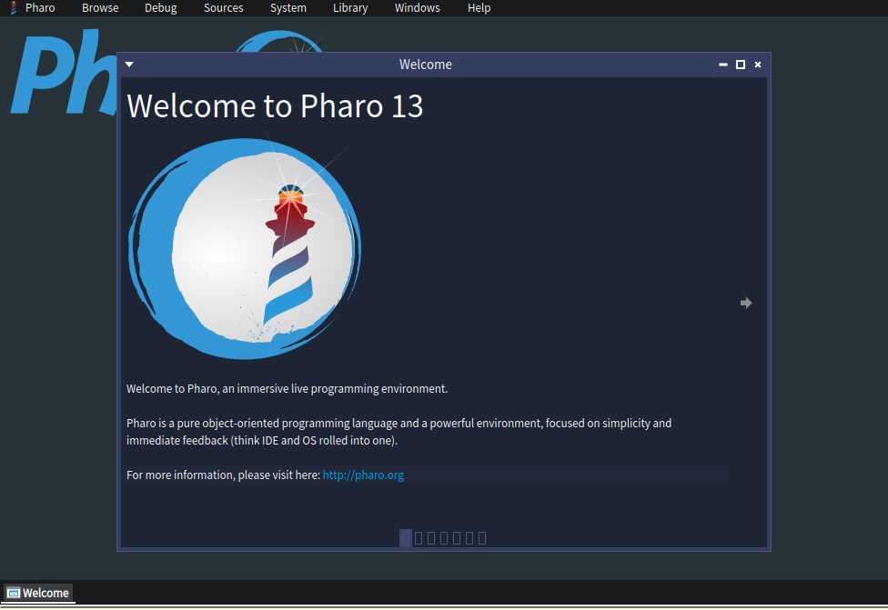

# PharoByExample150

By the book , captain - spock - the wrath of khan - star trek.

Lets get started .

This is a very simple introduction to Pharo smalltalk , what you learn here is applicable to every Smalltalk.

If you managed to download and install pharo successfully you will be greeted with a window that looks something like this



This is the welcome screen of Pharo - Pharo 13 to be precise. 

As a beginner you will want to start with the Playground.

You can open a playground by pressing Ctrl + O + P .

Holding down the 'Control key' - your keyboard may have a key that says 'Ctrl' . 

While keeping the 'Control key' pressed down , press and *release* the letter 'O' key - O for Oranges , now press and *release* the letter 'P' key - P for Peter .

you should hopefully see something like this , it will say Playground on the title of the window


Inside the playground I have written a small program , you can type this is in as well 

```
'Hello' reverse. 
```

The world Hello is followed by a space followed by the word reverse .  Notice also the world Hello is surround by single quote characters ' . 


To evaluate this program can press the do it all button 

you will see an Inspector open up. 


What we have done is open a playground , run some code and see the result of the program having been run.

The inspector allows us access inside the result that we got handed back.

In this case the letters of Hello reversed or rather olleH .


One way of reading the program is - i give you the letters Hello and i want you to reverse them for me.  Lucky for us - this is exactly what happens.

An inspector is a way to look further into the thing you got back .  

The pharo language is very procedural.


A string in smalltalk is starts and ends with a single quote.


