# PharoByExample150

By the book , captain - spock - the wrath of khan - star trek.

Lets get started .

This is a very simple introduction to Pharo smalltalk , what you learn here is applicable to every Smalltalk.

To install pharo - you can download and run the launcher 


click new for a new image


now click create image

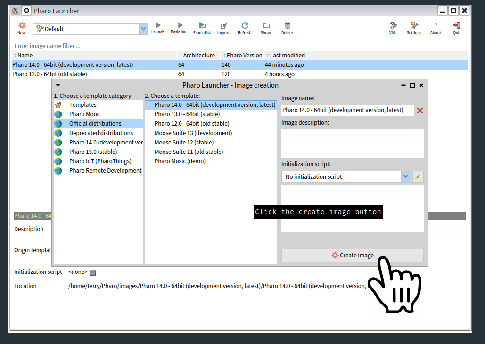

select desired version of Pharo required 

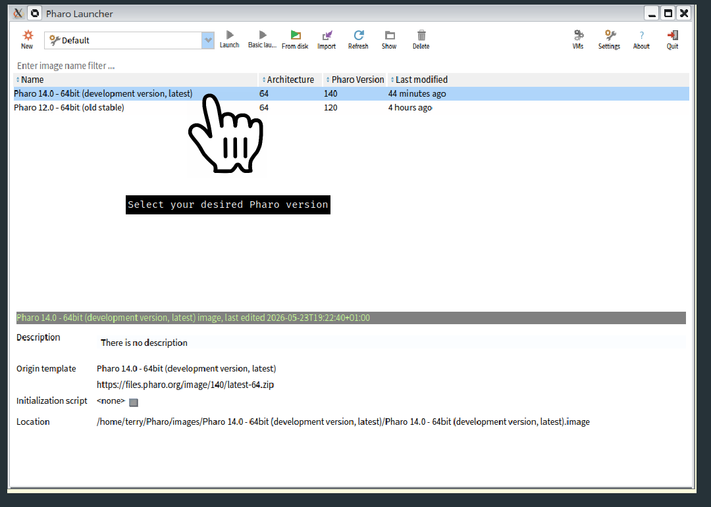

finally click Launch to start using Pharo 

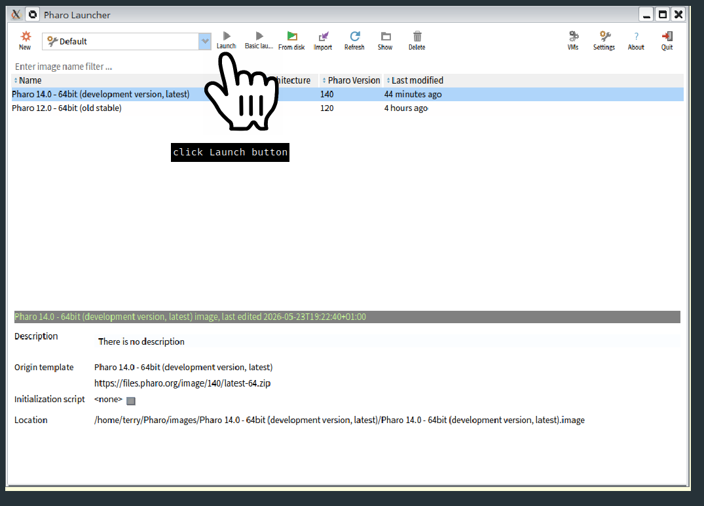


# Pharo first steps 

you should be greeted with a window that looks something like this


This is the welcome screen of Pharo 

As a beginner you will want to start with the Playground.

You can open a playground by pressing Ctrl + O + P .

Holding down the 'Control key' - your keyboard may have a key that says 'Ctrl' . 

While keeping the 'Control key' pressed down , press and *release* the letter 'O' key - O for Oranges , now press and *release* the letter 'P' key - P for Peter .

you should hopefully see something like this , it will say Playground on the title of the window


In Smalltalk something surrounded by single quotes is interpreted as a String.


Lets type a quick program into the playground

```
'Hello' reverse. 
```


Lets run this program 

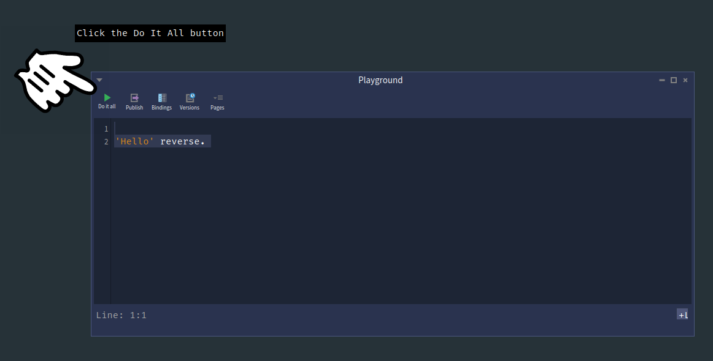

if all goes well you will see an Inspector open up . The inspector allows us access inside the result that we got handed back. In this case the letters of Hello reversed or rather olleH .

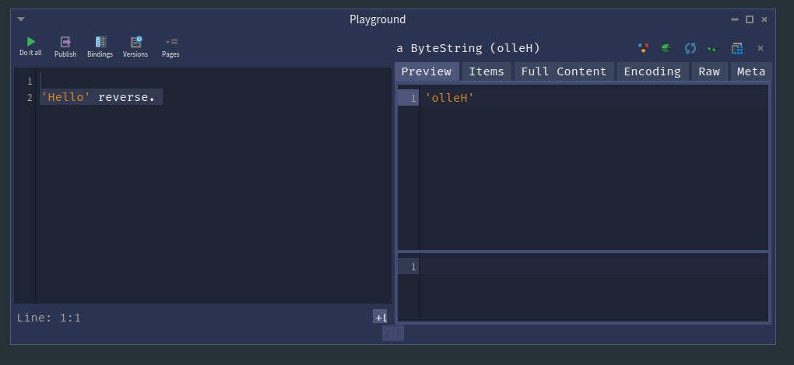

We can see the result is a ByteString. 

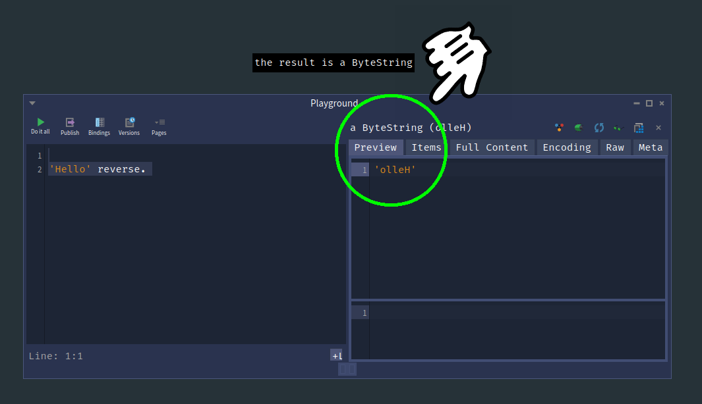

We can compute anything in either window we wish . 

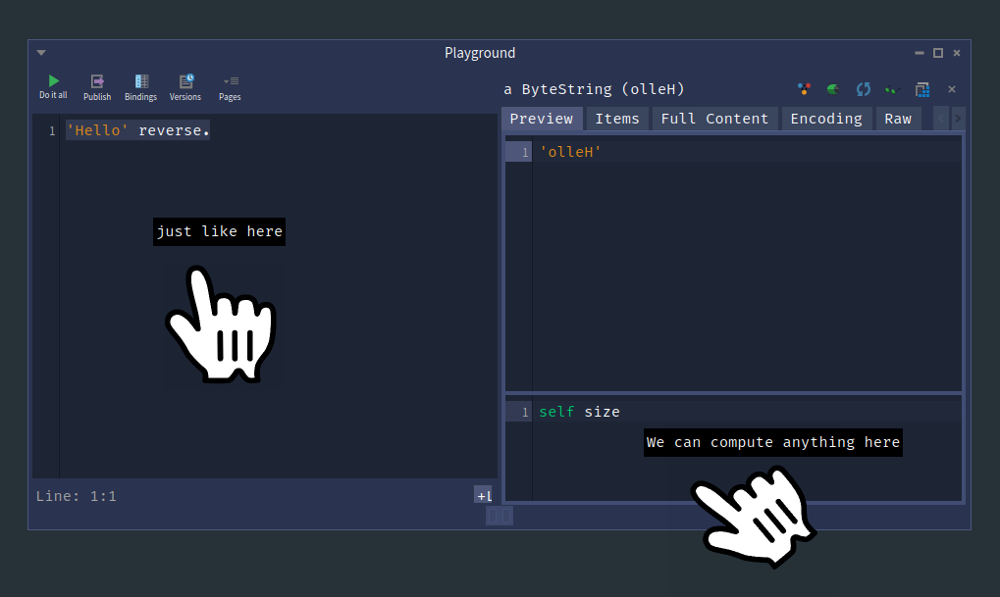


We can drill deeper by asking how many letters are in this string 'olleH' . To do this we must select
the code we want - then press Control g - this runs 'Do it and Go' , which means it will execute the code and open a further inspector window on the results to the right of current window. Every execution in subsequent windows using Control g will open up further windows, drilling deeper and deeper.

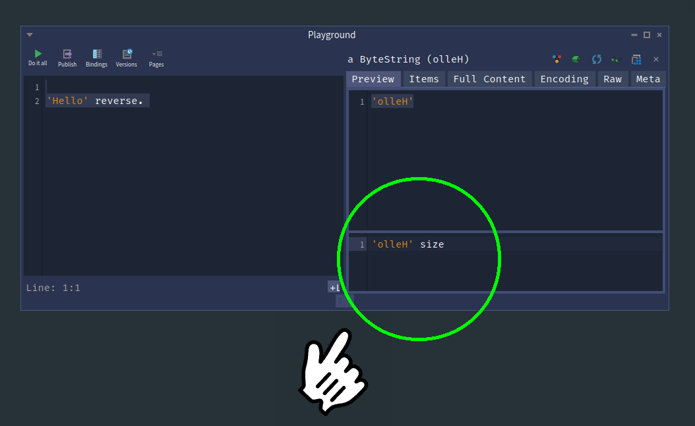

finding the answer is indeed five as expected 

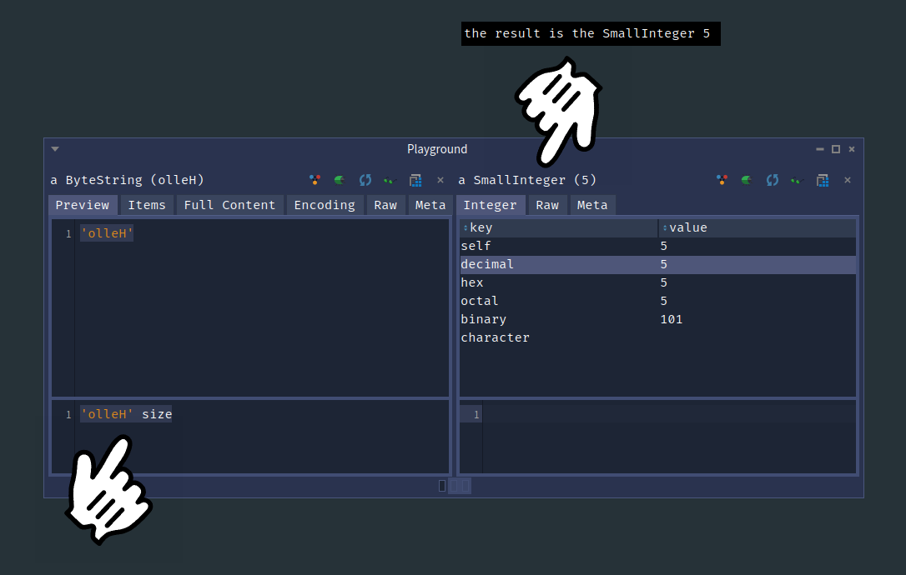

what is nice is the ability to drill down as deep as want 

Lets see if five really is greater than four 

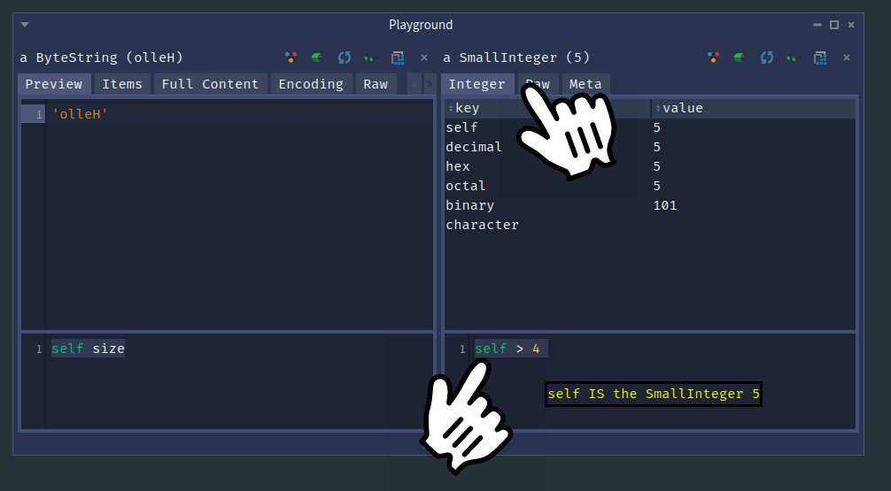

We can now say for definite that five really is greater than four

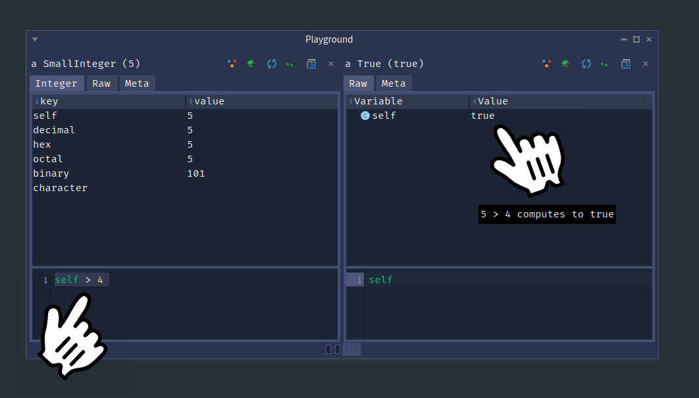

It is important to note that the word self has special meaning in smalltalk.

Let us look once again at the size of a ByteString . We can drill down by selecting what we 
want to examine further by selecting the code and typing Control g .

This will tell pharo to 'Do it and Go' .

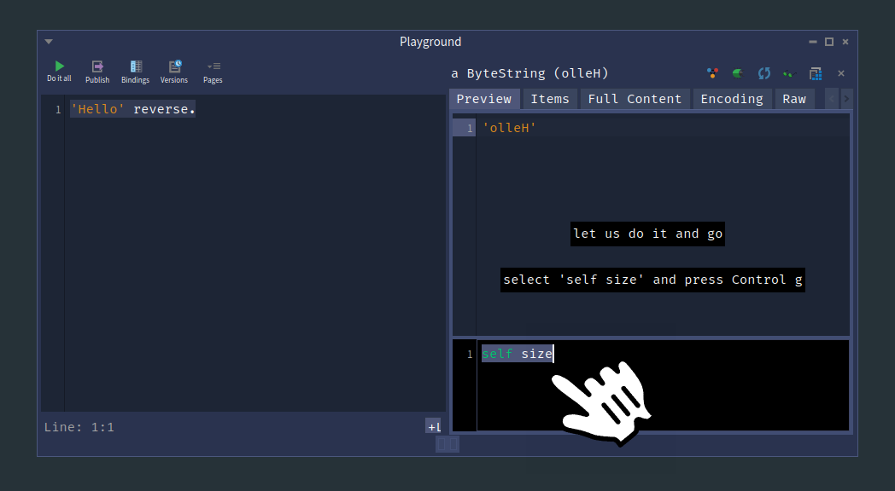

Now we see two inspection windows which both refer to their own self . 

The self on the left bubble is talking about a ByteString . 

The self on the right bubble is talking about the SmallInteger (5) .

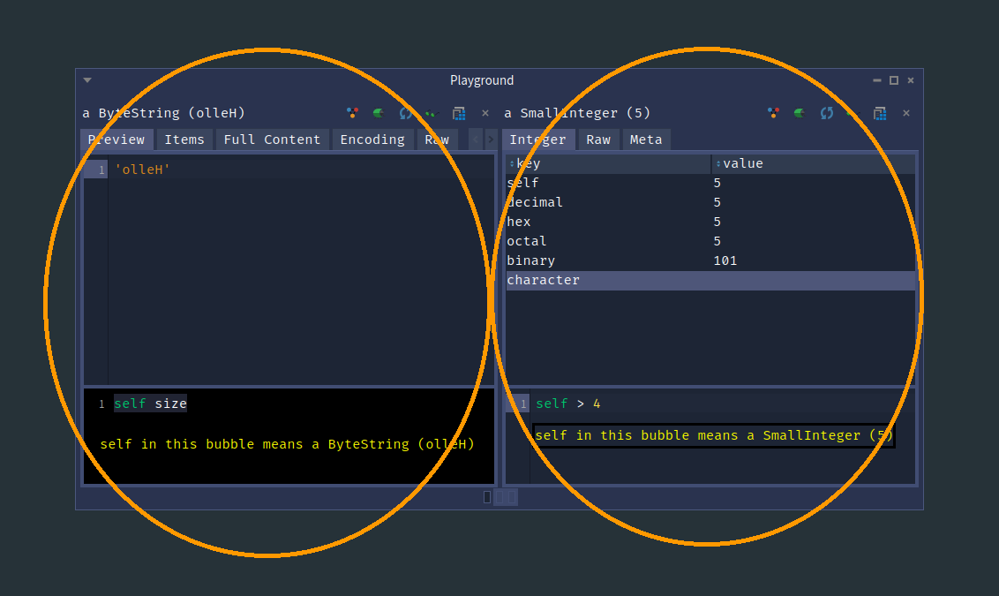


# recap 


To recap - we have opened a Playground , wrote a simple program , run the program , got the result


The Playground is split into two regions 

We have a main coding area initially 


and inspector regions which themselves have a mini playground at the bottom


the mini playground at the bottom is in context of the result above 

given a different result - the context will be different.


# Appendix 

Some essential morph code to load images from local disk and internet urls , some text and circles ,
makes highlighting and explaining what is going on a lot easier to the reader.


```
handForm := ImageReadWriter formFromFileNamed: '/home/terry/code/PharoByExample150/docs/Chapters/Chapter1/figures/hand-pointer-icon.png'.
pointer := ImageMorph new form: handForm; openInWorld; yourself.


handForm := ImageReadWriter formFromFileNamed: '/home/terry/code/PharoByExample150/docs/Chapters/Chapter1/figures/pharo-launcher-2026-05-23_20-07.png'.
pointer := ImageMorph new form: handForm; openInWorld; yourself.


"Load an image from a URL and create an ImageMorph"
handImage := ZnEasy getPng: 'https://images.icon-icons.com/1464/PNG/512/pointinghand_100160.png'.
pointer := ImageMorph new form: handImage; openInWorld; yourself.

"Move it programmatically"
pointer position: 300@300.

circle := CircleMorph new openInWorld ; color: (Color white alpha: 0.0) ; borderWidth: 5 ; borderColor: (Color green) ; extent: 300@300 ; yourself.


ellipse := EllipseMorph new openInWorld ; color: (Color white alpha: 0.0) ; borderWidth: 5 ; borderColor: (Color orange) ; extent: 300@300 ; yourself.


"Create a TextMorph with explanatory text"
indicator := TextMorph new.
indicator contents: 'This is the inspector region';
    color: Color yellow;
    borderWidth: 3;
    borderColor: Color black;
    extent: 200@40;
    position: 100@100;
    openInWorld.


"change text , foreground and background colours"
indicator color: (Color white) . 
indicator backgroundColor: (Color black).
indicator contents: 'Click here'.


```

really annoying to have to keep trying to find the edge of the playground

lets create a button which will send the playground to the back of the stack

Lets create a playground class with slots '#play' and '#button'.
```
Object << #GoodPlayground
	slots: { #play . #button };
	package: 'YourTools'
```

```
initialize

 "lets create a simple playground with some initial content"
	play := StPlayground openContents: self playgroundContents. 

	"lets create a simple button to do something useful "
	button := SimpleButtonMorph new
		          label: 'Run Code';
		          target: self;
		          actionSelector: #processInput:;
		          arguments: { play };
		          color: Color black;
		          yourself. 
	"Add button to world or another morph"
	button openInWorld.
```

something for the playground to initially show when it opens up 

```
playgroundContents 
^ '''Hello'' reverse.'
```

and the all important function we needed at start to send the thing to the back , 


```
processInput: aSpWindowPresenter
aSpWindowPresenter window sendToBack.
```

so my hand morphs and circles etc can be drawn over top of the playground

we can change text on the SimpleButtonMorph

```
self label: 'Send to Back'.
```


